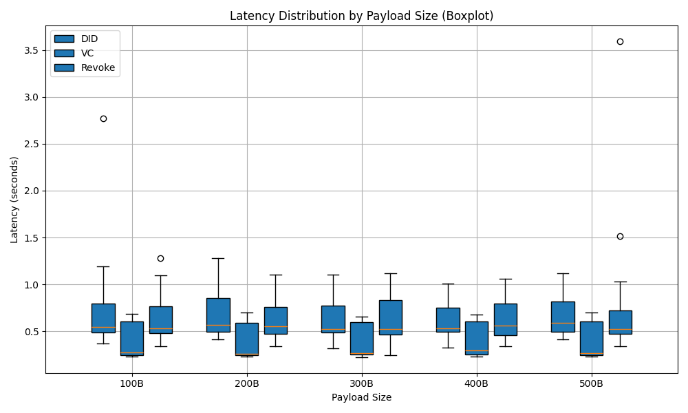
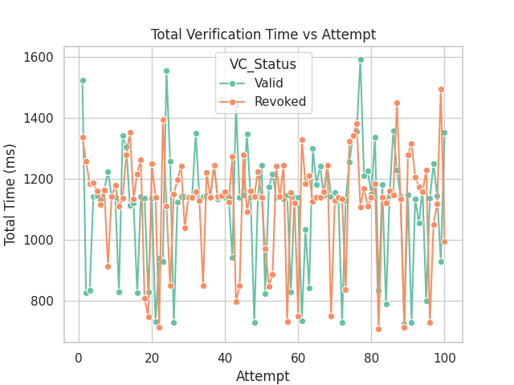
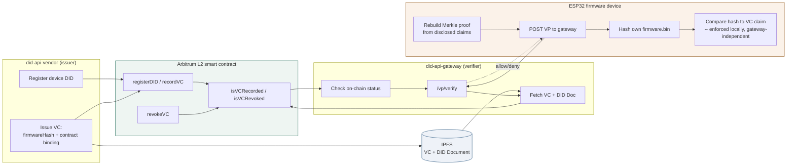

# DIDAuth-IoTFW

**DIDAuth-IoTFW** is a decentralized identity and firmware-authentication
framework for smart-home IoT devices. It replaces a centralized,
single-point-of-failure firmware pipeline with W3C Decentralized Identifiers
(DIDs) and Verifiable Credentials (VCs), anchored on an Ethereum Layer-2
(Arbitrum) smart contract and backed by IPFS for content-addressed storage.
A firmware image's hash is bound directly into its credential, and every
device verifies that credential — and its own firmware's hash against it —
**on-device**, so a compromised or unreachable gateway can never trick a
device into accepting the wrong firmware.

[](https://github.com/awijesundara/DIDAuth-IoTFW/actions/workflows/ci.yml)
[](https://github.com/awijesundara/DIDAuth-IoTFW/commits/main)
[](https://github.com/awijesundara/DIDAuth-IoTFW)
[](https://github.com/awijesundara/DIDAuth-IoTFW)
[](LICENSE)
[](https://doi.org/10.1016/j.iot.2025.101788)
[](https://www.sciencedirect.com/science/article/pii/S2542660525003026)
[](did-api-gateway/requirements.txt)
[](did-api-vendor)
[](did-iot-firmware)
[](did-api-vendor/blockchain)

<table>
<tr>
<td width="50%"><br><sub>Credential operation latency by payload</sub></td>
<td width="50%"><br><sub>ESP32 end-to-end verification time</sub></td>
</tr>
</table>

This repository is the reference implementation and proof-of-concept behind
the peer-reviewed paper below: two FastAPI backends (issuer and verifier), an
ESP32 firmware example that performs real on-device VC/VP verification, and
the performance/security analysis used to produce the paper's results.

## How it works



1. **Register & issue** — the vendor registers the device's DID on-chain and
   issues a VC binding the firmware image's hash to that DID and to the
   deploying contract (preventing cross-registry replay).
2. **Publish** — the VC and DID Document are published to IPFS; their
   lifecycle state (recorded/revoked) is anchored on Arbitrum.
3. **Present & verify** — the device rebuilds a Merkle proof from its
   selectively-disclosed claims, wraps it in a Verifiable Presentation, and
   the gateway checks signature validity, on-chain status, and revocation.
4. **Enforce locally** — the device independently hashes its own firmware
   and compares it to the credential's claim itself, so verification holds
   even if the gateway is compromised or offline.

## Components

| Component | Role |
|---|---|
| [`did-api-vendor`](did-api-vendor) | Issues firmware credentials |
| [`did-api-gateway`](did-api-gateway) | Verifies credentials against on-chain state |
| [`did-iot-firmware`](did-iot-firmware) | ESP32 proof-of-concept — on-device VC/VP verification (see its [README](did-iot-firmware/README.md) for build/flash instructions and a device-level architecture diagram) |
| [`performance-analysis`](performance-analysis) | Latency/throughput measurement scripts and results |
| [`security-analysis`](security-analysis) | Threat-model and security tests (`run_threat_model_tests.sh`) |

## Publication

> W.M.A.B. Wijesundara, Joong-Sun Lee, Eleni Aloupogianni, Dara Tith,
> Hiroyuki Suzuki, Takashi Obi,
> **"DIDAuth-IoTFW: Decentralized firmware authentication for smart home IoT
> devices using verifiable credentials,"**
> *Internet of Things*, Volume 34, 2025, 101788, ISSN 2542-6605.
> [https://doi.org/10.1016/j.iot.2025.101788](https://doi.org/10.1016/j.iot.2025.101788)

<details>
<summary><strong>Abstract</strong></summary>

Rapid proliferation of smart home IoT devices has intensified the demand for
secure, scalable, and autonomous firmware authentication mechanisms.
Traditional centralized solutions face challenges related to privacy
concerns, limited scalability, and vulnerability to single point of failure.
In this paper, we propose DIDAuth-IoTFW, a novel decentralized identity and
firmware authentication framework that uniquely integrates Ethereum Layer-2
Arbitrum, InterPlanetary File System (IPFS), and W3C-compliant Decentralized
Identifiers (DIDs) and Verifiable Credentials (VCs). DIDAuth-IoTFW provides a
complete firmware authentication life cycle, from decentralized identity
registration to real-time, on-chain verifiable revocation, while enabling
autonomous, cryptographic verification directly on resource-constrained IoT
devices and ensuring reliable performance even when gateways are compromised
or unavailable. Our proof-of-concept implementation on ESP32 and Raspberry Pi
achieved complete resistance to replay, forgery, and revocation threats with
verification consistently under 1.2 s. Compared to prior work, DIDAuth-IoTFW
uniquely combines firmware–VC hash binding, contract binding that prevents
cross-registry replay, and device-side enforcement resilient to gateway
compromise. Experimental results indicate a robust, privacy-preserving, and
scalable alternative to centralized firmware-update pipelines for
smart-home IoT.

</details>

**Keywords:** Decentralized identity · Distributed ledger technologies ·
Ethereum Layer-2 · Arbitrum · Verifiable credentials · Information security ·
Communication systems · IPFS

### Citation

```bibtex
@article{wijesundara2025didauthiotfw,
  title   = {{DIDAuth-IoTFW}: Decentralized firmware authentication for smart home {IoT} devices using verifiable credentials},
  author  = {Wijesundara, W.M.A.B. and Lee, Joong-Sun and Aloupogianni, Eleni and Tith, Dara and Suzuki, Hiroyuki and Obi, Takashi},
  journal = {Internet of Things},
  volume  = {34},
  pages   = {101788},
  year    = {2025},
  issn    = {2542-6605},
  doi     = {10.1016/j.iot.2025.101788}
}
```

## License

MIT License
© 2025 Anushka Wijesundara

## Project statistics

| Metric | Value |
|---|---|
| Tracked files | 77 |
| Lines of code (non-blank) | 2,807 |
| Languages | Python 1,742, C++ (Arduino) 639, Shell 357, Solidity 45, JavaScript 24 |
| Automated tests | 9 |
| Commits | 10 |

CI compiles both FastAPI services and runs the gateway and vendor test suites on each push to `main`.
