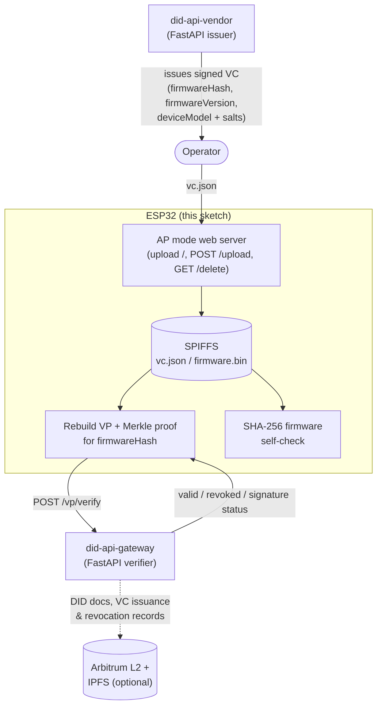

# DID IoT Firmware

An ESP32 Arduino sketch demonstrating device-side verification of a
verifiable credential (VC) that attests a firmware image's identity and
hash. It is the on-device half of the DIDAuth-IoTFW proof of concept
described in the [repo-level README](../README.md); the other half is the
`did-api-vendor` (issuer) and `did-api-gateway` (verifier) FastAPI services.

## What it does

1. Boots as a Wi-Fi access point (`ESP32-VC-Uploader` / `12345678`) and
   serves a one-page upload form so an operator can push a `vc.json` file
   (a VC issued by `did-api-vendor`, wrapping selectively-disclosed claims
   and their salts) onto the device's SPIFFS filesystem.
2. Once `vc.json` is present, it joins the configured home/lab Wi-Fi network.
3. It rebuilds a Merkle proof for the `firmwareHash` claim from the VC's
   disclosed claims/salts, wraps the VC in a verifiable presentation (VP),
   and POSTs the VP to the gateway's `/vp/verify` endpoint.
4. It independently computes the SHA-256 hash of its own firmware image
   (`/firmware.bin` on SPIFFS) and compares it against the hash asserted in
   the credential, so a compromised or unavailable gateway cannot force the
   device to accept a mismatched firmware.
5. The credential can be wiped and the process restarted via
   `http://<device_ip>/delete`.

Optional, disabled by default (`VERIFY_SIGNATURE` / `USE_SECURE_ELEMENT` in
`esp32_fw.ino`): on-device Ed25519 signature verification of the credential,
and marking the device DID's key as living in a secure element.

## Hardware

- Any ESP32 dev board (this was built/tested against a generic `esp32dev`
  target — see `platformio.ini`).
- USB cable for flashing and serial monitoring.
- No external wiring/peripherals are required; the sketch only uses the
  ESP32's built-in Wi-Fi and flash (via SPIFFS).

## Build & flash

This directory is a standalone [PlatformIO](https://platformio.org/) project.

```bash
# from did-iot-firmware/
pio run                 # compile
pio run -t upload       # flash over USB
pio device monitor      # view serial output (115200 baud)
```

Library versions are pinned in `platformio.ini`:

| Library | Version |
|---|---|
| `bblanchon/ArduinoJson` | ^7.2.1 |
| `ESP32Async/ESPAsyncWebServer` | ^3.7.0 |
| `ESP32Async/AsyncTCP` | ^3.3.5 |

`ESP32Async/*` is the actively maintained continuation of the original
`me-no-dev/ESPAsyncWebServer` and `AsyncTCP` libraries, which are no longer
updated.

If you prefer the Arduino IDE instead of PlatformIO, install the ESP32
board package (arduino-esp32 core 3.x) plus the three libraries above via
the Library Manager, open `esp32_fw.ino` directly, and select an ESP32
board before compiling/uploading.

Before flashing, edit the placeholders at the top of `esp32_fw.ino`:

- `staSSID` / `staPassword` — the Wi-Fi network the device should join
  after receiving a credential.
- `verificationURL` — the `did-api-gateway` instance's `/vp/verify` URL.

> This environment could not compile the sketch — no PlatformIO/Arduino
> toolchain was available. Please run `pio run` locally to verify before
> flashing.

## Architecture



Auth flow in short: **vendor issues a VC → operator loads it onto the
device → device presents a VP with only the disclosed claims it needs →
gateway checks the VC's signature, revocation status, and (optionally)
on-chain issuance record → device separately confirms its own firmware
hash matches what the credential asserts.**
